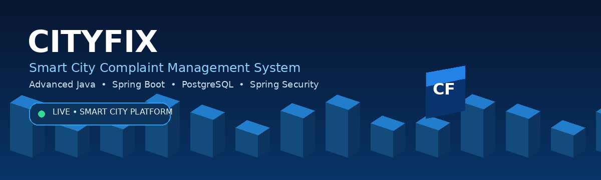

<div align="center">

<a href="https://cityfix-hmv8.onrender.com/" target="_blank">
  
</a>

# 🏙️ CityFix
### Smart City Complaint Management System

**A real-world web application developed as part of the Advanced Java course.**

[](https://cityfix-hmv8.onrender.com/)
[](https://github.com/rabbi1067/cityFix)
[](https://www.java.com/)
[](https://spring.io/projects/spring-boot)
[](https://www.postgresql.org/)

</div>

---

## 📌 About CityFix

**CityFix** is a web-based city complaint management platform designed to make reporting, tracking, and resolving urban problems more organized and transparent.

Citizens can report problems with details and images, track progress, and provide a rating after resolution. Administrators can review complaints, manage status, record resolution information, and monitor reports from a centralized dashboard.

---

## ✨ Key Features

### 👤 Citizen Features
- Secure registration and login
- Forgot Password / Password Reset
- Profile and personal information management
- Submit complaints with images
- Complaint location and map view
- Track complaint status and history
- Rating and feedback after resolution
- Account settings
- Day / Night mode

### 🛠️ Admin Features
- Admin dashboard
- Manage citizens and complaints
- Review and process reported issues
- Update complaint status
- Manage complaint resolution
- Add resolution details and cost information
- Reports and statistics
- Role-based access control

### 🤖 Smart Features
- AI-assisted issue category and location detection
- Estimated Resolution Cost suggestion
- Public complaint / map visualization
- Location-aware complaint handling

### 🎨 User Experience
- Light / Dark mode
- Responsive mobile, tablet and desktop views
- Professional loading animations
- Form validation and error handling
- Clean and user-friendly interface

---

## 🏗️ Architecture

```text
Thymeleaf UI
     ↓
Controllers
     ↓
Services / Business Logic
     ↓
Repositories / Spring Data JPA
     ↓
PostgreSQL
```

---

## 🛠️ Technology Stack

| Category | Technology |
|---|---|
| Language | Java |
| Framework | Spring Boot |
| Web | Spring MVC |
| Security | Spring Security |
| ORM | JPA / Hibernate |
| Database | PostgreSQL |
| Template Engine | Thymeleaf |
| Build Tool | Maven |
| Boilerplate | Lombok |
| Containerization | Docker |
| Deployment | Render |
| Version Control | Git & GitHub |

---

## 📚 What I Learned

- Building a complete Spring Boot web application
- Designing Controller → Service → Repository architecture
- Working with JPA / Hibernate and relational databases
- Implementing authentication and authorization
- DTOs, validation and exception handling
- File and image upload management
- Role-based access control
- Responsive UI development
- Smart / AI-assisted functionality
- Dockerizing and deploying a Spring Boot application
- Managing a real-world project with Git and GitHub

---

## 🎓 Course & Acknowledgement

This project was developed as part of the **Advanced Java** course.

A special thanks to our course faculty **Asaduzzaman Noor Sir** for his continuous guidance, valuable feedback, and support throughout the course and project development.

---

## 🚀 Try CityFix

🌐 **Live Project:** https://cityfix-hmv8.onrender.com/

💻 **GitHub Repository:** https://github.com/rabbi1067/cityFix

Everyone is welcome to explore the application and test its features.

---

<div align="center">

### 🏙️ CityFix
**Smarter City • Happier Citizens**

Built with ❤️ using **Java & Spring Boot**

[🌐 Live Project](https://cityfix-hmv8.onrender.com/) · [💻 GitHub Repository](https://github.com/rabbi1067/cityFix)

</div>
